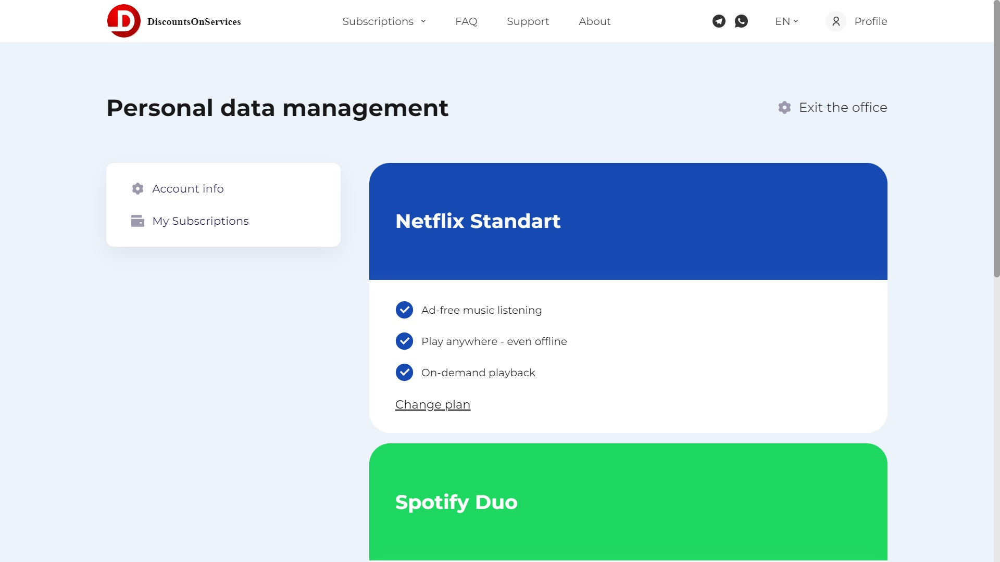

# Portfolio__DiscountsOnServices

### Technology stack
      
---
### ✔️Кроссбраузерность🌐  
### ✔️Адаптивность 🖥️💻📱
### Приветствую, мой дорогой читатель. В этом пет-проекте я реализую небольшое web-приложение. Это сайт на котором можно приобрести подписки на популярные приложения по скидке. В проекте пока нет back-end, но через JS прописана вся логика для работы с пользователем. 
### Функционал для User:
- Регистрация Usera, и сохранение его в массив данных со всеми пользователями в LocalStorage(нет общей базы данных, пока что);
- Вход в аккаунт уже ранее зарегитрированного User, если он вышел из аккаунта;
- Покупка подписок;
- Отображение всех купленных подписок каждого отдельного Userа в личном кабинете Usera, доступного после авторизации;
- Изменение подписки, например с "YouTube Music" на "YouTube Premium" и так далее(spotify, netflix), с дальнейшей их перезаписью в LS отдельного User;
- Изменение данных(email, name) Usera, с дальнейшем сохранением в LS и корректным отображением в личном кабинете;
- А так же множество отдельных всплывающих окон для взаимодействия с Userоm(тех.поддержка, запрос на дополнительную компанию для подписки и т.д.);

### Скриншот личного кабинета:
;
---

